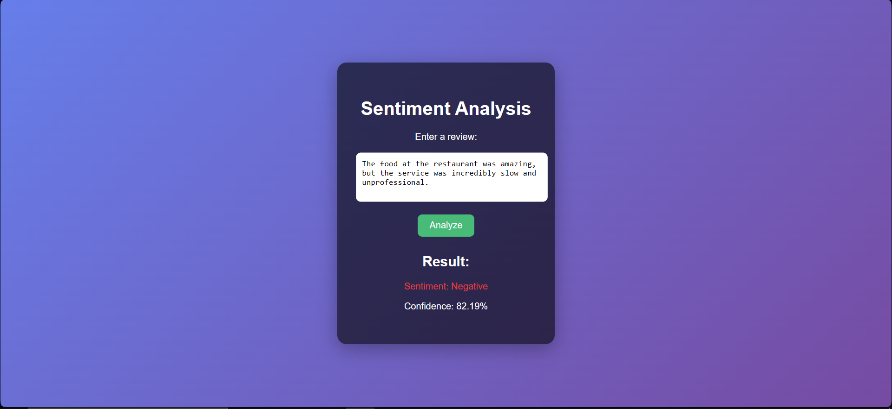

# Review Sentiment Analysis using BiLSTM

This repository contains a deep learning-based **review sentiment analysis** project using a **Bidirectional LSTM (BiLSTM)** model. The model is trained on the **Amazon Polarity Dataset** and predicts whether a given review expresses a **positive** or **negative** sentiment. 

## Features

- **Deep Learning Model**: Built using **TensorFlow/Keras** with a BiLSTM architecture for handling sequential text data.  
- **Preprocessing**: Includes tokenization, padding, and embedding layers using TensorFlow.  
- **Training & Evaluation**: Achieves high accuracy on the Amazon Polarity dataset, demonstrating strong performance in sentiment classification.  
- **Inference**: The model predicts the sentiment of new text inputs with confidence scores.  

## Dataset

The dataset used in this project is **Amazon Polarity** from Hugging Face:  
🔗 [Amazon Polarity Dataset](https://huggingface.co/datasets/amazon_polarity)  

This dataset consists of **Amazon product reviews** labeled as either **positive (1)** or **negative (0)**.

## Model Performance

The model was trained for **20 epochs** and achieved the following performance:  

- **Training Accuracy**: ~94%  
- **Validation Accuracy**: ~93%  
- **Precision, Recall, F1-score**: ~0.94  

## Web App Screenshot

## Notebook

📌 The complete Jupyter Notebook for this project is available on **Kaggle**:  
🔗 [Sentiment Analysis Notebook](https://www.kaggle.com/code/vrishin04/sentiment-analysis/notebook)  

